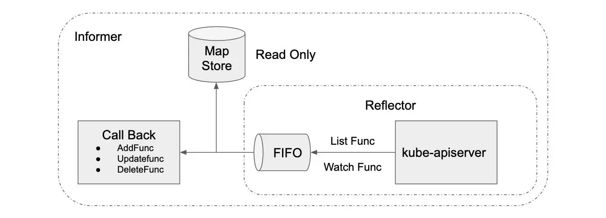

# Informer

## 组成部分

+ Controller：Informer 的实施载体，可以创建 reflector 及控制 processLoop。processLoop 将DeltaFIFO 队列中的数据 pop 出，首先调用Indexer进行缓存并建立索引，然后分发给 processor 进行处理。

+ Reflector：Informer 并没有直接访问 api-server，而是通过一个叫 Reflector 的对象进行 api-server 的访问。Reflector 通过 ListAndWatch 监控指定的 kubernetes 资源，当资源发生变化的时候，例如发生了 Added 资源添加等事件，会将其资源对象存放在本地缓存 DeltaFIFO 中。

+ DeltaFIFO：是一个先进先出的缓存队列，用来存储 Watch API 返回的各种事件，如Added、Updated、Deleted。

+ Indexer：Indexer 使用一个线程安全的数据存储来存储对象和它们的键值。需要注意的是，Indexer 中的数据与 etcd中 的数据是完全一致的，这样 client-go 需要数据时，无须每次都从 api-server 获取，从而减少了请求过多造成对 api-server 的压力。一句话总结：Indexer 是用于存储+快速查找资源。

+ Processor：记录了所有的回调函数（即  ResourceEventHandler）的实例，并负责触发回调函数

## 使用 client-go 自定义 controller

controller 可以使用 informer 来绑定事件的回调函数，以实现对对象的控制。比如对于 replicaset 而言，监听三种事件，判断 replicaset 实际的 replicas 数量是否符合预期，若不符合预期，则进行相应的扩缩容。

### 最佳实践

源自：https://raw.githubusercontent.com/HanFa/learn-k8s/master/lesson3/lesson3_slides.pdf

+ 启动 worker goroutine 之前，先确保 **cache is synced**

    + Replicaset controller 例子

        https://github.com/kubernetes/kubernetes/blob/b7b824bb9e01edb39411b8c139eab592af0d667/pkg/controller/replicaset/replica_set.go#L208
    + Sample controller 例子

        https://github.com/HanFa/sample-controller/blob/735d68047545e2fd1fd2bf3c04526f2cf9614e7c/controller.go#L160

+ 从cache，或者说informer里拿到的object, 如果要写入，一定要先进行deepcopy，避免 cache 里面的 object被污染。indexer 里面的数据只读的。

    + Replicaset controller 例子

        https://github.com/kubernetes/kubernetes/blob/b7b824bb9e01edfb39411b8c139eab592af0d667/pkg/controller/replicaset/replica_set.go#L712
    + Sample controller 例子
        https://github.com/kubernetes/sample-controller/blob/f42769d51c5abf1dcc8f887fe1086b14bff6a573/controller.go#L325

+ Informer 的周期性 resync 机制会导致重复冗余的 update 事件，用 ResourceVersion 进行 **early return**

    + Replicaset controller 例子

        https://github.com/kubernetes/kubernetes/blob/b7b824bb9e01edfb39411b8c139eab592af0d667/pkg/controller/replicaset/replica_set.go#L420
    + Sample controller 例子

        https://github.com/kubernetes/sample-controller/blob/f42769d51c5abf1dcc8f887fe1086b14bff6a573/controller.go#L134
    
+ 使用shareinformer来让多个informer共享一个cache；使用NewSharedInformerFactory来新建informer的reference给控制器使用。

    https://github.com/HanFa/sample-controller/blob/b3876539afadc37d7b8fc6bd3a2cfd61fb39df4a/main.go#L62
