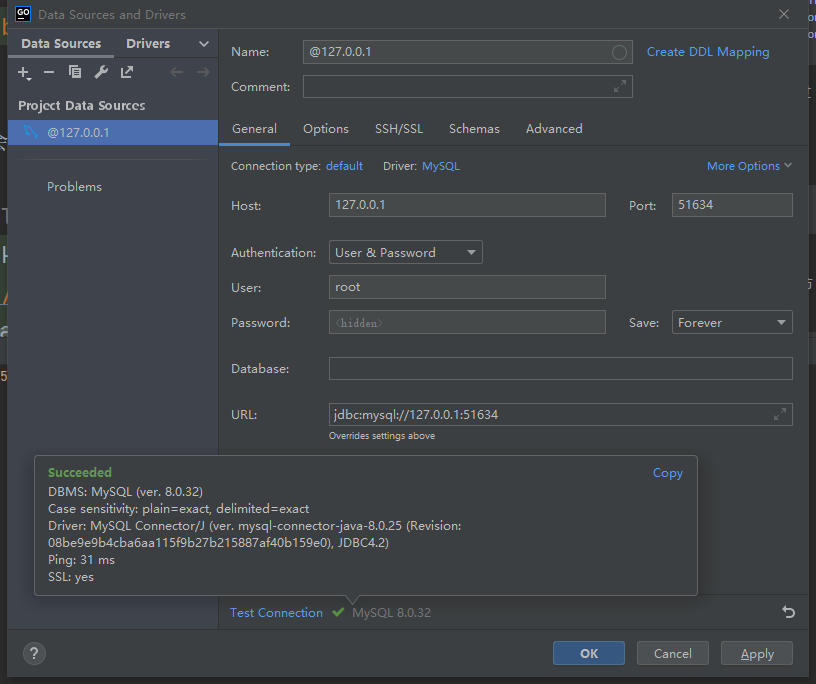

# Lab 1
该 lab 基于 Minikube，用于练习 K8s 最基本的 Api Object，如 ConfigMap，Secret，Pod，Service 等等。

## 使用 Secret 指定 Mysql 密码

```shell
kubectl apply -f lab1/mysql_secret.yml
```

该 YAML 文件中制定了数据库的密码。

```yaml
stringData:
  db_password: '123456'
```

在创建 Mysql 对应的 Pod 的时候，可以使用这个 Secret 来指定 Mysql 的密码。
如下所示，使用环境变量指定 Mysql root 用户的密码，这个密码源自 Secret 中定义的 db_password
```yaml
env:
    - name: MYSQL_ROOT_PASSWORD
    valueFrom:
      secretKeyRef:
        name: mysql-secret
        key: db_password
```

创建 Mysql 对应的 Pod：
```shell
kubectl apply -f lab1/mysql_pod.yml
```

验证 Mysql 正确指定了密码：

```shell
kubectl exec -it mysql -- mysql -uroot -p123456
```

有关 Secret 的更多声明方式：https://github.com/omerbsezer/Fast-Kubernetes/blob/main/K8s-Secret.md

## 创建 Mysql 对应的 Service

```shell
kubectl apply -f lab1/mysql_service.yml
```

该 YAML 文件中指定了选中的 Pod 以及端口。使用 NodePort 的方式会在每个 Node 的 ip 上暴露一个端口，
来访问对应的 Service 服务。
同时，可以随机暴露出一个端口外部访问的端口（默认值：30000-32767）。

一般而言，对于数据库这种服务，应该使用 ClusterIp，只在集群内部使用，这边为了测试服务连接，故暴露给外部。

```yaml
spec:
  type: NodePort
  selector:
    app: db
  ports:
    - protocol: TCP
      port: 3306
      targetPort: 3306
```

这里的 selector 对应了 `lab1/mysql_pod.yml` 中指定的 labels：
```yaml
labels:
  app: db
```

创建该 Service：
```shell
kubectl apply -f lab1/mysql_service.yml
```

查看当前的 Service：
```shell
$ kubectl get svc
NAME            TYPE        CLUSTER-IP       EXTERNAL-IP   PORT(S)          AGE
kubernetes      ClusterIP   10.96.0.1        <none>        443/TCP          25m
mysql-service   NodePort    10.108.143.219   <none>        3306:30160/TCP   14s
```

可以看到集群暴露了 30160 的端口给外部使用，不过我们使用的是 Minikube，所有的 k8s 组件都跑在 Docker 容器里，
所以我们必须要用 tunnel 才能真正访问该 Service：

```shell
minikube service --url mysql-service
```

该指令会开启一个 tunnel，并且提供一个可访问的 url，相当于让我们能够去访问 30160 端口，并最终访问到内部的 Service。

```shell
$ minikube service --url mysql-service
http://127.0.0.1:51634
❗  Because you are using a Docker driver on windows, the terminal needs to be open to run it.
```

可以用一些数据库工具来验证是否能够连接：



## 使用 ConfigMap 配置数据库信息

ConfigMap 和 Secret 基本一致，只不过后者用于存储密文信息。但是注意，单纯使用 Secret 仍然存在风险，
因为其使用的 base64 并不能保证安全性，应该配合 k8s 提供的 RBAC 机制使用。

这边指定了使用的 mysql-server。

```yaml
data:
  db_server: "mysql-service"
```

添加该 ConfigMap：
```shell
kubectl apply -f lab1/mysql_configmap.yml
```

我们启动一个测试 Pod 查看效果：

```shell
kubectl apply -f lab1/test_pod.yml
```

在该 Pod 内部查看环境变量是否正确：
```shell
kubectl exec -it test -- bin/sh
echo $MYSQL_SERVER
echo $MYSQL_ROOT_PASSWORD
```

应该得到如下的输出：
```shell
$ kubectl exec -it test -- bin/sh
/ # echo $MYSQL_SERVER
mysql-service
/ # echo $MYSQL_ROOT_PASSWORD
123456
```

注意，k8s 里的 Service 是 ping 不通的，以下摘自：https://kuboard.cn/learning/faq/ping-service.html
> 因为 Kubernetes 只是为 Service 生成了一个虚拟 IP 地址，实现的方式有：
> + User space 代理模式
> + Iptables 代理模式
> + IPVS 代理模式
> 
> 不管是哪种代理模式，Kubernetes Service 的 IP 背后都没有任何实体可以响应「ICMP」，全称为 Internet 控制报文协议（Internet Control Message Protocol）。

我们可以在 test pod 里面安装 telnet 指令，查看连接情况：
```shell
apk update
apk add busybox-extras
```

**注意，可以直接用 Service 的名字，依靠 DNS 访问服务，但是这里只是 hostname，还需要指定端口号**
```shell
telnet "$MYSQL_SERVER:3306"
```

## 修改 ConfigMap 之后更新 Pod

我们可以通过以下方式对 Api Object 的配置进行修改，以之前的 ConfigMap 为例：
```shell
kubectl edit configmap mysql-config
```

这会启动一个文本编辑器让你进行修改。这里我们把 `db_server` 修改成了 `dummy`。
我们再次进入 test Pod，看看环境变量是否改变：

```shell
kubectl exec -it test -- bin/sh
echo $MYSQL_SERVER
```

输出依旧是之前的 `mysql-service`，也就是说修改 ConfigMap 不会导致引用它的 Pod 的自动更新。我们需要一些其他手段让 Pod 在 ConfigMap 更新的时候也进行更新。

### 使用 Deployment

Deployment 可以支持滚动升级，当我们的 ConfigMap 修改的时候，可以认为是一次版本变动，我们可以通过 Deployment 更新对应的 Pod。 

我们先删除之前的 test Pod，

```shell
kubectl delete -f lab1/test_pod.yml
```

接下来我们要用 Deployment 来管理这个 Pod。Deployment 的 Template 对应了 Pod 的 Spec。

创建对应的 Deployment：
```shell
kubectl apply -f lab1/test_deployment.yml
```

查看生成的 Pod(s)：
```shell
$ kubectl get pods
NAME                   READY   STATUS    RESTARTS   AGE
mysql                  1/1     Running   0          102m
test-7775f744b-c7sgs   1/1     Running   0          25s
```

进入该 Pod 查看环境变量：

```shell
kubectl exec -it test-7775f744b-c7sgs -- bin/sh
echo $MYSQL_SERVER
```

输出为 `dummy`，现在我们把 configmap 修改为之前的版本。

然后，我们使用如下方法（ https://www.qttc.net/504-how-update-latest-configmap-in-pods.html ）更新 Pod：
```shell
kubectl rollout restart deploy/test
```

我们可以在另外两个终端，通过：
```shell
kubectl get rs -w
```

以及 
```shell
kubectl get pods -w
```
查看发生的变化：
```
$ kubectl get rs -w
NAME             DESIRED   CURRENT   READY   AGE
test-7775f744b   1         1         1       9m32s
test-595fb97b87   1         0         0       0s
test-595fb97b87   1         0         0       0s
test-595fb97b87   1         1         0       0s
test-595fb97b87   1         1         1       5s
test-7775f744b    0         1         1       9m58s
test-7775f744b    0         1         1       9m58s
test-7775f744b    0         0         0       9m58s
```

```
$ kubectl get pods -w
NAME                   READY   STATUS    RESTARTS   AGE  
mysql                  1/1     Running   0          112m 
test-7775f744b-c7sgs   1/1     Running   0          9m46s
test-595fb97b87-mqb2m   0/1     Pending   0          0s
test-595fb97b87-mqb2m   0/1     Pending   0          0s
test-595fb97b87-mqb2m   0/1     ContainerCreating   0          0s
test-595fb97b87-mqb2m   1/1     Running             0          5s
test-7775f744b-c7sgs    1/1     Terminating         0          9m58s
test-7775f744b-c7sgs    0/1     Terminating         0          10m
test-7775f744b-c7sgs    0/1     Terminating         0          10m
test-7775f744b-c7sgs    0/1     Terminating         0          10m
```

可以通过如下指令查看 Deployment 的历史版本：

```shell
kubectl rollout history deploy/test
```

我们再次进入 test Pod，查看环境变量：
```shell
kubectl exec -it test-595fb97b87-mqb2m -- bin/sh
echo $MYSQL_SERVER
```

更新成功：`mysql-service`。具体的，还可以根据 https://github.com/omerbsezer/Fast-Kubernetes/blob/main/K8s-Rollout-Rollback.md 中提到的两种策略，指定更新策略。
`Recreate` 是全部删除，然后新建（显然服务会有一段时间 Down），而 `RollingUpdate` 也就是滚动升级，两个版本的 Pod 将同时存在，慢慢将所有 Pod 变为最新版本（关闭一部分旧的，开启一部分新的）。

### 使用 Kustomize

项目网址：https://github.com/kubernetes-sigs/kustomize

> kustomize lets you customize raw, template-free YAML files for multiple purposes, leaving the original YAML untouched and usable as is.

推荐阅读：
+ https://developer.aliyun.com/article/1110336
+ https://blog.csdn.net/liwench/article/details/129849776
+ https://stackoverflow.com/questions/71165168/can-someone-explain-patchesstrategicmerge

我们先删除之前测试的残留：
```shell
kubectl delete -f lab1/mysql_configmap.yml
kubectl delete -f lab1/test_deployment.yml
```

创建如下的 Kustomization.yml：
```yaml
resources:
  - test_deployment.yml
configMapGenerator:
  - name: mysql-config
    literals:
      - db_server=mysql-service
```

查看对应的生成结果（只是打印，没有创建）：
```shell
kubectl kustomize lab1/base
kubectl kustomize lab1/stagging
```

应用到 k8s：
```shell
kubectl apply -k lab1/base
```

查看生成的 ConfigMap：
```shell
$ kubectl get configmap
NAME                      DATA   AGE
kube-root-ca.crt          1      164m
mysql-config-5bhm7k67gb   1      38s
```

进入 Pod，查看环境变量：

```shell
kubectl exec -it test-6fc4d8f9cc-f6zwr -- bin/sh
echo $MYSQL_SERVER
```

结果为 mysql-service，和预期一致。

接下来修改为 `dummy`。

```shell
kubectl apply -k lab1/stagging
```

可以发现自动创建了新的 Pod：
```shell
$ kubectl get pods
NAME                    READY   STATUS        RESTARTS   AGE
mysql                   1/1     Running       0          166m
test-6fc4d8f9cc-f6zwr   1/1     Terminating   0          2m13s
test-85d74d7669-d9ft8   1/1     Running       0          26s
```

进入 Pod，查看环境变量：

```shell
kubectl exec -it test-85d74d7669-d9ft8 -- bin/sh
echo $MYSQL_SERVER
```

输出为 `dummy`，成功！
